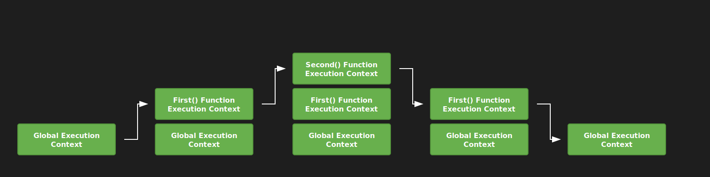

## JS Call stack(Стек вызовов)
**Stack** — bu **LIFO**(Last In, First Out) prinsipi boýunça işleýän, ýerine ýetiriş kontekstlerini saklamak üçin ulanylýan ýatdyr.

Haçan-da JS Engine skripti işläp başlanda, global ýerine ýetiriş kontekstini döredýär we ony häzirki stack-a geçirýär. Funksiýa çagyrlanda bolsa, engine şol funksiýa üçin täze ýerine ýetiriş kontekstini döredýär we ony stack-yň ýokarsyna geçirýär.

Engine(Движок) stack-yň ýokarsynda ýerleşýän funksiýany ýerine ýetirýär. Funksiýa tamamlanandan soň, onuň konteksti stack-dan aýrylýar we dolandyryş ondan öňki stack elementinde ýerleşýän kontekste geçirilýär.

Stack-da nämeler saklanýar:
 - Primitiv maglumat tiplleri(number, string, boolean, null, undefined, symbol, bigint)
 - Obýektlere salgylanmalar (ýöne obýektleriň özi däl)
 - Funksiýanyň ýerine ýetiriliş kontekstleri

```js
let a = 'Hello World!';
function first() {
    console.log('Внутри первой функции');
    second();
    console.log('Снова внутри первой функции');
}
function second() {
    console.log('Внутри второй функции');
}

first();
console.log('Внутри глобального контекста выполнения');
```
Ýokarky kod ýerine ýetirilende stack-yň üýtgeýşi👇



Kod brauzere ýüklenende, JavaScript Engine global ýerine ýetiriş kontekstini döredýär we ony stack-a geçirýär. `first()` funksiýasy çagyrylanda, engine bu funksiýa üçin täze kontekst döredýär we ony stack-yň ýokarsyna geçirýär.

`second()` funksiýasy `first()` funksiýasyndan çagyrylanda, bu funksiýa üçin täze ýerine ýetiriş konteksti döredilýär we edil öňkiler ýäly stack-a geçirilýär. `second()` funksiýasy tamamlanandan soň, onuň konteksti  stack-dan aýrylýar we ondan soňky ýerine ýetiriş kontekstine, ýagny `first()` funksiýasynyň kontekstine geçirilýär.

`first()` funksiýasy tamamlanandan soň, onuň konteksti stack-dan aýrylýar we global kontekste geçýär. Ähli kod ýerine ýetirilenden soň, engine stack-dan global ýerine ýetiriş kontekstini hem aýyrýar.
